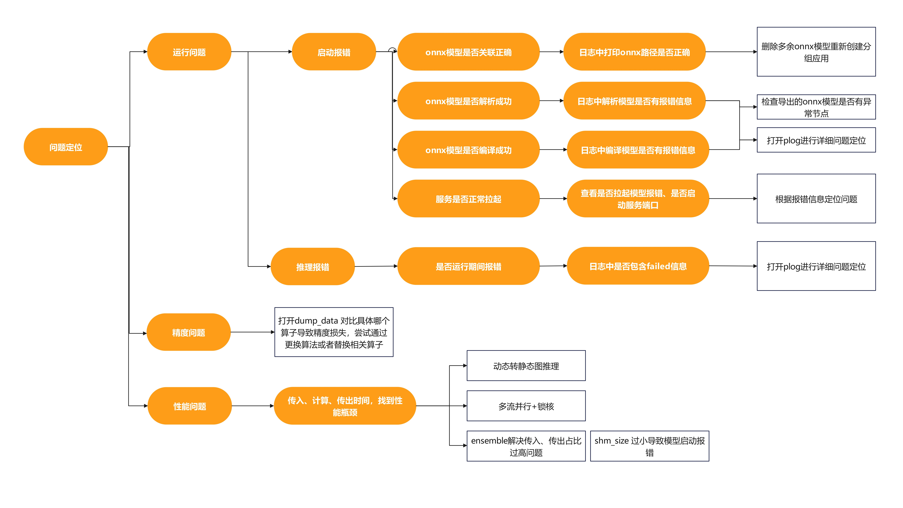

# README

## 新版本特性 v2.2.0
1. 支持从onnx文件读取模型输入输出信息, config中若无指定input，output，将会自动从文件中读取；   
2. 调整动态图在多实例下使用多Session方式，提高并发吞吐(显存占用会增高)；
3. 支持动态batch场景小batch动态合并特性，配合多Session，提高吞吐；
4. 补充调优方法论以及cnclip模型的最佳实践；
5. 支持多模型特性，可支持同时拉起多个模型，提高现存利用率；
6. 支持非0轴动态shape场景；
7. 支持TensorFlow的pb文件。

## 介绍
ge-backend基于triton inference server框架实现对接NPU生态，快速实现传统CV\NLP模型的服务化。   
triton inference server相关介绍请参考：
https://docs.nvidia.com/deeplearning/triton-inference-server/user-guide/docs/index.html

### 实现原理
triton inference server 提供了Custom backend 接口，允许通过自定义backend实现非GPU设备接入。

### 接入方法
1.  将本工程编译的backend文件libnpu_ge.so安装到 {Triton-server源码安装目录}/backends/npu_ge/,  启动triton-inference-erver服务端, server在拉起模型过程中根据模型设置，选择npu_ge后端对推理请求进行分发。  
2.  ge_backend 采用 GE组图方式进行推理，基于C++实现，支持GE的图优化、UB融合、多流并行等诸多特性，以便更好的为服务化模型提供更高吞吐。   
3.  模型在使用该框架时需要统一转换为Onnx格式，并基于triton-inference-server规范，配置模型相关config以及版本信息。


### 特性支持情况
|  特性名称 | 介绍 |支持情况 |
|  ------  | ------   |------   |
|  多模型 |可支持一个server启动多个模型| √ |
|  多实例 |模型可同时处理多个请求，此特性需搭配多流并行或多卡使用| √ |
|  多卡支持 |一个模型可同时跑在多张卡上，每张卡可配置>1 的实例| √ |
|  多卡负载均衡|多卡情况下能根据每张卡上任务数量动态分配请求 | 目前仅支持所有请求shape一致场景  |
|  动态batch|支持input、output 的0轴为可变场景| √ |
|  GE静态图 |通过shape固定，实现初始化图时分配好所有显存，提高图执行效率| √ |
|  多流并行 |多实例场景下NPU支持多Stream，提高NPU利用率| √ |
|  锁核 |配置每一条stream使用Cube以及Vector核心数量，以便多stream情况下提高吞吐| √ |
|  非0轴动态 |支持非0轴情况下的动态shape| √ * |
|  自动配置 | 支持onnx模型自动读取input、output免配置| √ * |
* *若output中包含动态轴，在导出onnx时需指定其与input中轴的关系，详情请查看 [模型转换为onnx](#执行推理)   

## 环境准备
若使用910B或310P，可以直接在AscendHub获取相关容器运行，其余型号可根据以下教程制作。   

### AscendHub 镜像获取
登录昇腾镜像仓库 https://www.hiascend.com/developer/ascendhub   
搜索 "triton-inference-server-ge-backend"  
根据昇腾卡片信息选择选择相应的镜像版本(目前仅上传910B、310P基于cann8.3.rc1的版本，其余版本需要用户自行生成镜像)

### 自制镜像
项目中提供了910B的镜像制作文件，可参考项目中的'Dockerfile' 进行创建。若使用不同型号、不同版本cann，需自行更换初始镜像。

### 进入容器
执行以下命令进入容器：
```
docker run -itd --privileged --name=triton_npu --net=host --shm-size=500g \
    --device /dev/davinci1 \
    --device /dev/davinci_manager \
    --device /dev/devmm_svm \
    --device /dev/hisi_hdc \
    -v /usr/local/dcmi:/usr/local/dcmi \
    -v /usr/local/bin/npu-smi:/usr/local/bin/npu-smi \
    -v /usr/local/Ascend/driver/lib64/:/usr/local/Ascend/driver/lib64/ \
    -v /usr/local/Ascend/driver/version.info:/usr/local/Ascend/driver/version.info \
    -v /etc/ascend_install.info:/etc/ascend_install.info \
	  -v /data/:/data/ \
	  -v /home/:/home/ \
    -it {镜像名称} bash

docker exec -it triton_npu bash
```

## 编译 ge backend 
若使用AscendHub镜像，相关二进制已放在/opt/tritonserver 相关目录下，无需二次编译。  
若自行编译，需参考Dockerfile进行环境配置后，执行以下指令进行编译：
```
cd {npu ge onnx backend 目录}
export TRITON_HOME_PATH=/opt/tritonserver
bash build.sh
```
执行完成后，会在{TRITON_HOME_PATH}的backends目录下创建npu_ge文件夹以及相关的.so文件

## 执行推理
目前项目统一需要将模型转换为onnx或TensorFlow的冻结图pb文件进行在线编译。
### Torch模型转换为onnx
因昇腾目前适配并不支持最新的onnx版本，相关模型若要在NPU上推理需要用户自行导出，不要使用官方下载的onnx文件，有可能会导致模型编译、推理报错！！！    
可使用torch自带能力进行导出，导出
``` python
import torch.onnx
torch.onnx.export(model,
            (image, text),
            'model.onnx',
            input_names=['image','text'],
            output_names=['unnorm_image_features',"unnorm_text_features"],
            dynamic_axes={
                'image':{0:"bs"，2："width", 3："height"}, 
                'text':{0:"bs"},
                'unnorm_image_features':{0:"bs"，2："width", 3："height"},
                'unnorm_text_features':{0:"bs"，2："width", 3："height"}
            },
            export_params=True,
            do_constant_folding=False,
            opset_version=14,
            verbose=True)
```
其中：
model.onnx 为生成的onnx文件名称。  
input_names 为对应的入参名称  
output_names 为对应的出参名称  
opset_version 为使用的编译版本，默认建议选择14版本。具体请参考昇腾文档。  
dynamic_axes 为动态轴，比如image 的第0轴为 batchsize，则需要声明 {0:"bs"}   
<font color="#dd0000"> 注意：   
当前版本仅支持0轴为bs。 非0轴支持动态，但为了支持NPU计算过程，需要声明时满足output中出现的轴名称在input中存在，或output中的轴名称为计算过程，可以通过input中已存在的值进行计算得出   
比如：output值 'unnorm_text_features':{0:"bs"，2："width", 3："height"} 中出现的所有动态轴名称在input中均存在；   
比如：output值 'unnorm_text_features':{0:"bs"，2："width*3600/2+height"} 中2轴为计算公式，可以通过计算得出相应的轴大小。当前仅支持 +-*/() 运算符。   
</font>

执行完成后会在当前路径下生成 model.onnx 模型文件。  

生成的onnx文件可以使用 onnxsim 工具进行优化。
```
pip install onnxsim 
onnxsim  model.onnx new_model.onnx
```
执行完成后会输出前后节点对比。

#### 附录：插件支持shape类型
|  onnx文件shape | 示例 | config配置情况  |  支持情况  |
|  ------  | ------   |------   |------   |
|  全静态 | [1, 3, 224, 224] | 手动配置为[1,3,224,224] | 支持动态图、静态图 |
|  全静态 | [1, 3, 224, 224] | 未配置 | 支持动态图、静态图 |
|  0轴为Batch轴，其余固定shape | [bs, 3, 224, 224] | 手动配置为[1,3,224,224] | 支持动态图、静态图 |
|  0轴为Batch轴，其余固定shape | [bs, 3, 224, 224] | 手动配置为[-1,3,224,224] | 支持动态图、静态图(拆分多batch为多个1batch进行计算) |
|  0轴为Batch轴，其余固定shape | [bs, 3, 224, 224] | 未配置 | 支持动态图、静态图(拆分多batch为多个1batch进行计算) |
|  0轴为Batch轴，其余轴有-1 | [bs, 3, width, height] | 手动配置为[1,3,224,224] | 支持动态图、静态图 |
|  0轴为Batch轴，其余轴有-1 | [bs, 3, width, height] | 手动配置为[-1,3,224,224] | 支持动态图、静态图(拆分多batch为多个1batch进行计算) |
|  0轴为Batch轴，其余轴有-1 | [bs, 3, width, height] | 手动配置为[-1,3,-1，-1] | 支持动态图，静态图不支持 |
|  无batch轴，存在-1 | input0[m,k]、input1[k,n]、output[m,n] | 手动配置为静态[2,3],[3,4] | 支持动态图，静态图 |
|  无batch轴，存在-1 | input0[m,k]、input1[k,n]、output[m,n] | 手动配置为[-1，-1],[-1，-1] | 支持动态图，静态图不支持 |
|  无batch轴，存在-1 | input0[m,k]、input1[k,n]、output[m,n] | 未配置 | 支持动态图，静态图不支持 |


### TensorFlow模型转换为pb
TensorFlow保存图graph、权重weights的过程称为freezing，在保存过程中会产生一个protobuf文件，简称pb文件。导出并保存pb文件的方法使用的是原生TensorFlow框架的能力，下面仅简要给出一些步骤示例。  
1. 保存SavedModel模型。   
```
tf.saved_model.save(network, "save_path")
```
在save_path文件夹下会生成如下文件/文件夹：   
```
|--- save_model.pb     # 保存网络结构
|--- variables         # 权重参数存储目录
|--- assets            # 所需的外部文件存储目录，例如初始化的词汇表文件
```
2. 冻结pb模型。  
加载上述步骤导出的SavedModel模型，并将SavedModel模型冻结为带权重的pb模型，代码示例如下。  
``` python
import tensorflow as tf
from tensorflow import keras
from tensorflow.keras import models
from tensorflow.python.framework.convert_to_constants import convert_variables_to_constants_v2
from tensorflow.python.framework import graph_util

# 加载SavedModel模型
saved_model_dir = "save_path"
model = tf.saved_model.load(saved_model_dir)
# 初始化signatures
infer = model.signatures["serving_default"]
# 冻结带权重的pb文件
frozen_func = convert_variables_to_constants_v2(infer)
tf.io.write_graph(graph_or_graph_def=frozen_func.graph,
                     logdir="./",
                     name="frozen_graph.pb",
                     as_text=False)
```
详细Tensorflow迁移请参考 [TensorFlow模型迁移](https://www.hiascend.com/document/detail/zh/TensorFlowCommunity/83RC1alpha003/migration/tfmigr2/tfmigr2_000077.html)。

### 尝试运行
模型文件获取后，即可尝试使用triton inference server进行推理服务。   
根据triton inference server规范，模型需要按照如下规范创建相应说明文件。
#### 模型目录创建
创建一个模型文件夹类似如下结构。
```
models
└── cnclip
    ├── 1
    │   └── model.onnx # 或 model.pb
    └── config.pbtxt
```
其中 ：
cnclip 为模型名称
1 为模型版本   
model.onnx 或 model.pb 为需要执行推理的模型文件  
config.pbtxt 为模型描述，具体填写内容如下：  
```
name: "cnclip"
backend: "npu_ge"
max_batch_size: 128
input [ 
  {
    name: "image"
    data_type: TYPE_FP32
    dims: [3, 224, 224  ]
  }
]
output [
  {
    name: "unnorm_image_features"
    data_type: TYPE_FP32
    dims: [512 ]
  }
]
instance_group [{ 
  count: 1
}
]
parameters: [
{
  key: "device_ids",
  value: {string_value: "2"}
}
]

```
其中：  
name 为模型名称、与models内文件夹名称保持一致  
backend: 需填写npu_ge ，引导server 使用该backend对模型进行推理
max_batch_size 最大bs，当第0轴为bs时填写，若采用静态图，该字段需删除
input、output 模型输入、输出名称、形状、类型等信息。需与onnx模型中的输入输出一致。否则会报错！！！   
input、output 若不填写，则程序会尝试从onnx文件中读取，支持动态轴方式，但要满足限制条件，详情请参考 [模型转换为onnx](#模型转换为onnx)。 <font color="#dd0000">Tensorflow 目前不支持自动获取。</font>   
instance_group.count 实例数量，测试阶段可设置为1，若后期采用多流并行方案，或者多卡推理时，需要根据需要调整实例个数   
parameters.device_ids 模型使用的卡id，若为多卡比如 2卡、3卡，则填写 2,3   

当前版本支持动态bs，以及全静态方式。静态图通常拥有更好的性能，用户可根据业务需要进行选择：  

1，若bs 为动态，可以通过配置 max_batch_size 限定最大batch，
input、output中第0轴不需要声明，比如上面示例中，image 为4维，0轴为bs，不需要声明。规范跟随triton inference server。  
2，若bs为静态，则需要去掉 max_batch_size 并在input，output中声明第0轴的大小，如上例子 dims: [1，3, 224, 224  ]，静态图需要用户自行填写input、output。  

在input、output全为固定shape的情况下，可以添加参数开启静态图推理：
```
parameters: [
{
  key: "static_model",
  value: {string_value: "1"}
}
]
```
#### 模型启动
注：运行server时工作目录不要在models文件夹下执行，因执行过程中会生成meta文件导致server读取模型执行报错。  
模型文件夹生成后，即可执行如下命令尝试运行推理服务：  
```
/opt/tritonserver/bin/tritonserver --model-repository {/path/to/models} \
--http-port=9000 --grpc-port=9002 \
--backend-config=npu_ge,ge.aicoreNum="12|10" \
--backend-config=npu_ge,static_model="1" \
--backend-config=npu_ge,profiling="dynamic" \
--backend-config=npu_ge,dump_graph="1"
```
--model-repository 为模型文件夹路径，如上章节介绍，应填写 models 的路径。
可用参数可参考 triton inference server 相关文档。   
在官方基础上，该插件新增了如下参数：  
--backend-config=npu_ge,ge.aicoreNum 可以配置在启用静态图时，单stream使用cube、vector核数量，| 左边为cube数量，右边为vector数量，建议根据模型cv使用情况进行调整。默认关闭。  
--backend-config=npu_ge,static_model 是否开启ge静态图，只有在shape全部为固定值时才能开启，config.pbtxt 也可以配置，只需配置一个。默认不开启。   
--backend-config=npu_ge,profiling 是否开启profiling，若为ture，则采用静态采集，程序运行后立刻开始，若为dynamic，则需要使用另一线程，具体可参考昇腾文档。 开启后会在当前目录下生成profiling文件夹。默认关闭。  
--backend-config=npu_ge,dump_graph 是否dump GE图，默认关闭。   
<font color="#dd0000"> 注意：ge.xxx 相关的参数可直接通过在运行后缀中加入--backend-config=npu_ge,ge.xxx="yyy" 使能该参数生效</font>

启动完成后，在输出中可看到相应的 http端口信息。
```
I1113 03:06:28.108960 4560 grpc_server.cc:2519] Started GRPCInferenceService at 0.0.0.0:10002
I1113 03:06:28.109231 4560 http_server.cc:4637] Started HTTPService at 0.0.0.0:10001
I1113 03:06:28.150615 4560 http_server.cc:320] Started Metrics Service at 0.0.0.0:8002
```


#### client 调用
工程中自带example，用户可以调用其中的client 进行服务测试。具体使用方法请参考 triton inference server 相关文档。
``` shell
python client.py
```

调用成功后会输出output信息。

## 性能测试
可以使用NVIDIA官方工具 perf_analyzer 测试 triton-inference-server 性能。   
拉取镜像
```
export RELEASE=23.02
docker pull nvcr.io/nvidia/tritonserver:${RELEASE}-py3-sdk
docker run --rm --privileged -it --net=host nvcr.io/nvidia/tritonserver:${RELEASE}-py3-sdk
```
进入容器后，即可调用工具对模型进行测试：
```
perf_analyzer -m clip \
-x 1 \
-i http \
-u localhost:9090 \
-b 1 \
--shape image:3,224,224 \
--shape text:512 \
--concurrency-range 16
```
参数如下：   
-m	设置模型名称，如 clip \
-x	设置模型版本，根据想要测试模型的版本如实设置，如 1 \
-i	设置通信协议，选择有 http|grpc \
-u	设置通信地址url，如 localhost:9090 \
-b 	设置batch size ,如果是静态shape，则不填此参数 \
--shape	指定模型输入，以输入名称区分，如 image:3,224,224 如果填写了 -b 参数，则bs维度不需要写出 \
--concurrency-range	设置并发量，可以设定为单一值，如 16；也可以通过区间加步长进行设置，如1:1:16（start:step:end）\
-v -v 	打开详细日志 

执行成功后，会打印出相应的吞吐信息。


## 问题定位
### 定位思路

若运行模型过程中遇到问题，可参考如上定位流程使用相关工具进行问题定位。下面对常见问题进行梳理。

### 常见问题：
#### onnx模型未找到、查找错误
当前程序会在模型文件夹中自动查询onnx结尾的文件作为推理模型，若文件夹中放置多个onnx文件，可能会导致执行模型与期望模型不匹配，具体执行模型名称可在日志中查找：
```
find onnx path: xxxx/xxxx/xxx.onnx
```
#### 图解析问题：
若Log中出现如下字段：
```
aclgrphParseONNX execute failed, ret is: xxxxx
```
说明onnx解析过程中报错，需要启动plog日志，定位具体报错原因，如何使用plog请参考 [Plog使用方法](./docs/tools//Plog.md)   
常见的导致此问题的原因为未自行导出，使用官方镜像、输入输出字段不一致。

### 编译问题：
若Log中出现如下字段：
```
session_->CompileGraph failed, ret is:  xxxxx
```
说明onnx在编译过程中报错，需要启动plog日志，定位具体报错原因，如何使用plog请参考 [Plog使用方法](./docs/tools//Plog.md)   

### 推理问题：
若server启动时未见异常，程序启动成功，在使用client.py 验证推理服务时，报错，则通过以下方式定位：  
1，client端日志具体报错原因，若为调用模型名称、版本、input、output问题，需在客户端进行修改。
2，若调用过程中模型等配置无误，在server端出现报错
```
execute model failed, ret is: xxxxx
```
说明模型在执行推理过程中遇到问题，具体原因需打开plog进行定位

### 定位工具
#### plog使用：
在运行之前使用环境变量，修改Plog日志等级以及打印到标准输入输出：
```
export ASCEND_SLOG_PRINT_TO_STDOUT=1
export ASCEND_GLOBAL_LOG_LEVEL=1
```
具体功能描述请参考昇腾相关文档。   
在开启plog情况下，将日志保存，搜索一个 'ERROR' 字段，查看具体报错原因。
* 详细使用请参考 [Plog.md](docs/tools/Plog.md)

#### dump_graph:
GE成图后会根据图中的节点进行深度优化，融合。若要查看具体融合、优化过程，可通过dump_graph 查看每一步融合过程。  
在运行server 的模型脚本中，可添加如下字段进行GE图dump
```
--backend-config=npu_ge,dump_graph="1"
```
相关的GE图会dump到执行目录下的 dump_graph 目录下。
#### dump_data:
在推理问题定位过程中，有时需要存储每一个节点的输入输出信息，则可以通过dump data功能将执行过程中的输入输出进行保留从而定位问题。  
在运行server 的模型脚本中，可添加如下字段进行GE图dump data
```
--backend-config=npu_ge,dump_data="1"
```
相关的tensor会dump到执行目录下的 dump_data 目录下。

#### profiling:
在模型调优过程中，通常会通过profiling工具采集算子执行情况，进行进一步分析是否有优化空间。  
当前框架已集成了profiling功能，只需要通过开启开关即可profiling采集   
当前有两类采集方法：  
动态采集：在程序启动时不执行采集，当需要采集时，通过使用msprof发送指令给主进程启动采集。好处：可以在出现问题或者推理开始后按需进行profiling采集，防止全周期采集导致数据过大。  
普通采集：在程序启动后即开始进行采集，当主进程退出后进行数据整理打包。好处：使用简单，当可控进行推理时可以使用次方式。  
详细使用说明请参考 [Profiling使用方法](./docs/tools/Profiling.md)

## 性能调优方法论
用户可参考此文档逐步提高模型吞吐，将性能调整至最优，文章最后以cnclip模型迁移为例，展示模型从转换至接入、运行、调优全流程，请点击 [性能调优方法论](docs/性能调优方法论.md) 查看
