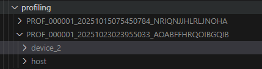
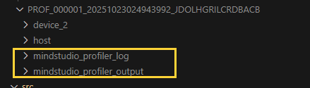
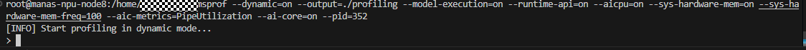

# README

## 介绍
ge-backend基于triton inference server框架实现对接NPU生态，快速实现传统CV\NLP模型的服务化。   
triton inference server相关介绍请参考：
https://docs.nvidia.com/deeplearning/triton-inference-server/user-guide/docs/index.html

### 实现原理
triton inference server 提供了Custom backend 接口，允许通过自定义backend实现非GPU设备接入。

### 接入方法
1.  将本工程编译的backend文件libnpu_ge.so安装到 {Triton-server源码安装目录}/backends/npu_ge/,  启动triton-inference-erver服务端, server在拉起模型过程中根据模型设置，选择npu_ge后端对推理请求进行分发。  
2.  ge_backend 采用 GE组图方式进行推理，基于C++实现，支持GE的图优化、UB融合、多流并行等诸多特性，以便更好的为服务化模型提供更高吞吐。   
3.  模型在使用该框架时需要统一转换为Onnx格式，并基于triton-inference-server规范，配置模型相关config以及版本信息。


### 特性支持情况
|  特性名称 | 介绍 |支持情况 |
|  ------  | ------   |------   |
|  多实例 |模型可同时处理多个请求，此特性需搭配多流并行或多卡使用| √ |
|  多卡支持 |一个模型可同时跑在多张卡上，每张卡可配置>1 的实例| √ |
|  多卡负载均衡|多卡情况下能根据每张卡上任务数量动态分配请求 | 目前仅支持所有请求shape一致场景  |
|  动态batch|支持input、output 的0轴为可变场景| √ |
|  GE静态图 |通过shape固定，实现初始化图时分配好所有显存，提高图执行效率| √ |
|  多流并行 |静态图搭配| √ |
|  锁核 |配置每一条stream使用Cube以及Vector核心数量，以便多stream情况下提高吞吐| √ |
|  非0轴动态 |支持非0轴情况下的动态shape| 开发中 |


## 环境准备
若使用910B或310P，可以直接在AscendHub获取相关容器运行，其余型号可根据以下教程制作。   

### AscendHub 镜像获取
登录昇腾镜像仓库 https://www.hiascend.com/developer/ascendhub   
搜索 "triton-inference-server-ge-backend"  
根据昇腾卡片信息选择选择相应的镜像版本(目前仅上传910B、310P基于cann8.3.rc1的版本，其余版本需要用户自行生成镜像)

### 自制镜像
项目中提供了910B的镜像制作文件，可参考项目中的'Dockerfile' 进行创建。若使用不同型号、不同版本cann，需自行更换初始镜像。

### 进入容器
```
docker run -itd --privileged --name=triton_npu2 --net=host --shm-size=500g \
    --device /dev/davinci1 \
    --device /dev/davinci_manager \
    --device /dev/devmm_svm \
    --device /dev/hisi_hdc \
    -v /usr/local/dcmi:/usr/local/dcmi \
    -v /usr/local/bin/npu-smi:/usr/local/bin/npu-smi \
    -v /usr/local/Ascend/driver/lib64/:/usr/local/Ascend/driver/lib64/ \
    -v /usr/local/Ascend/driver/version.info:/usr/local/Ascend/driver/version.info \
    -v /etc/ascend_install.info:/etc/ascend_install.info \
	-v /data/:/data/ \
	-v /home/:/home/ \
    -it swr.cn-south-1.myhuaweicloud.com/ascendhub/cann:8.3.rc1-910b-ubuntu22.04-py3.11 bash

docker exec -it triton_npu bash
```

## 编译 ge backend 
若使用AscendHub镜像，相关二进制已放在/opt/tritonserver 相关目录下，无需二次编译。  
若自行编译，需参考Dockerfile进行环境配置后，执行以下指令进行编译：
```
cd {npu ge onnx backend 目录}
export TRITON_HOME_PATH=/opt/tritonserver
bash build.sh
```
执行完成后，会在{TRITON_HOME_PATH}的backends目录下创建npu_ge文件夹以及相关的.so文件

## 执行推理
目前项目统一需要将模型转换为onnx进行接入，因昇腾目前适配并不支持最新的onnx版本，相关模型若要在NPU上推理需要用户自行导出，不要使用官方下载的onnx文件，有可能会导致模型编译、推理报错！！！  

### 模型转换为onnx
可使用torch自带能力进行导出，导出
```
import torch.onnx
torch.onnx.export(model,
            (image, text),
            'model.onnx',
            input_names=['image','text'],
            output_names=['unnorm_image_features',"unnorm_text_features"],
            dynamic_axes={
                'image':{0:"bs"}, 
                'text':{0:"bs"},
                'unnorm_image_features':{0:"bs"},
                'unnorm_text_features':{0:"bs"}
            },
            export_params=True,
            do_constant_folding=False,
            opset_version=14,
            verbose=True)
```
其中：
model.onnx 为生成的onnx文件名称。  
input_names 为对应的入参名称  
output_names 为对应的出参名称  
opset_version 为使用的编译版本，默认建议选择14版本。具体请参考昇腾文档。  
dynamic_axes 为动态轴，比如image 的第0轴为 batchsize，则需要声明 {0:"bs"}   
<font color="#dd0000"> 注意：当前版本仅支持0轴为动态轴， 其他轴需要根据需求调整为固定大小。  </font>

执行完成后会在当前路径下生成 model.onnx 模型文件。  

生成的onnx文件可以使用 onnxsim 工具进行优化。
```
pip install onnxsim 
onnxsim  model.onnx new_model.onnx
```
执行完成后会输出前后节点对比。

### 尝试运行
onnx文件获取后，即可尝试使用triton inference server进行推理服务。   
根据triton inference server规范，模型需要按照如下规范创建相应说明文件。
#### 模型目录创建
创建一个模型文件夹类似如下结构。
```
models
└── cnclip
    ├── 1
    │   └── model.onnx
    └── config.pbtxt
```
其中 ：
cnclip 为模型名称
1 为模型版本   
model.onnx 为需要执行推理的模型文件  
config.pbtxt 为模型描述，具体填写内容如下：  
```
name: "cnclip"
backend: "npu_ge"
max_batch_size: 128
input [
  {
    name: "image"
    data_type: TYPE_FP32
    dims: [3, 224, 224  ]
  }
]
output [
  {
    name: "unnorm_image_features"
    data_type: TYPE_FP32
    dims: [512 ]
  }
]
instance_group [{ 
  count: 1
}
]
parameters: [
{
  key: "device_ids",
  value: {string_value: "2"}
}
]

```
其中：  
name 为模型名称、与models内文件夹名称保持一致  
backend: 需填写npu_ge ，引导server 使用该backend对模型进行推理
max_batch_size 最大bs，当第0轴为bs时填写，若采用静态图，该字段需删除
input、output 模型输入、输出名称、形状、类型等信息。需与onnx模型中的输入输出一致。否则会报错！！！   
instance_group.count 实例数量，测试阶段可设置为1，若后期采用多流并行方案，或者多卡推理时，需要根据需要调整实例个数   
parameters.device_ids 模型使用的卡id，若为多卡比如 2卡、3卡，则填写 2,3   

当前版本支持动态bs，以及全静态方式。静态图通常拥有更好的性能，用户可根据业务需要进行选择：  

1，若bs 为动态，可以通过配置 max_batch_size 限定最大batch，
input、output中第0轴不需要声明，比如上面示例中，image 为4维，0轴为bs，不需要声明。规范跟随triton inference server。  
2，若bs为静态，则需要去掉 max_batch_size 并在input，output中声明第0轴的大小，如上例子 dims: [1，3, 224, 224  ]  

在input、output全为固定shape的情况下，可以添加参数开启静态图推理：
```
parameters: [
{
  key: "static_model",
  value: {string_value: "1"}
}
]
```
#### 模型启动
模型文件夹生成后，即可执行如下命令尝试运行推理服务：  
```
/opt/tritonserver/bin/tritonserver --model-repository {/path/to/models} \
--http-port=9000 --grpc-port=9002 \
--backend-config=npu_ge,ge.aicoreNum="12|10" \
--backend-config=npu_ge,static_model="1" \
--backend-config=npu_ge,profiling="dynamic" \
--backend-config=npu_ge,dump_graph="1"
```
可用参数可参考 triton inference server 相关文档。   
在官方基础上，该插件新增了如下参数：  
--backend-config=npu_ge,ge.aicoreNum 可以配置在启用静态图时，单stream使用cube、vector核数量，| 左边为cube数量，右边为vector数量，建议根据模型cv使用情况进行调整。默认关闭。  
--backend-config=npu_ge,static_model 是否开启ge静态图，只有在shape全部为固定值时才能开启，config.pbtxt 也可以配置，只需配置一个。默认不开启。   
--backend-config=npu_ge,profiling 是否开启profiling，若为ture，则采用静态采集，程序运行后立刻开始，若为dynamic，则需要使用另一线程，具体可参考昇腾文档。 开启后会在当前目录下生成profiling文件夹。默认关闭。  
--backend-config=npu_ge,dump_graph 是否dump GE图，默认关闭。   
<font color="#dd0000"> 注意：ge.xxx 相关的参数可直接通过在运行后缀中加入--backend-config=npu_ge,ge.xxx="yyy" 使能该参数生效</font>

启动完成后，在输出中可看到相应的 http端口信息。
```
I1113 03:06:28.108960 4560 grpc_server.cc:2519] Started GRPCInferenceService at 0.0.0.0:10002
I1113 03:06:28.109231 4560 http_server.cc:4637] Started HTTPService at 0.0.0.0:10001
I1113 03:06:28.150615 4560 http_server.cc:320] Started Metrics Service at 0.0.0.0:8002
```


#### client 调用
工程中自带example，用户可以调用其中的client 进行服务测试。具体使用方法请参考 triton inference server 相关文档。
``` shell
python client.py
```

调用成功后会输出output信息。

## 性能测试
可以使用NVIDIA官方工具 perf_analyzer 测试 triton-inference-server 性能。   
拉取镜像
```
export RELEASE=23.02
docker pull nvcr.io/nvidia/tritonserver:${RELEASE}-py3-sdk
docker run --rm --privileged -it --net=host nvcr.io/nvidia/tritonserver:${RELEASE}-py3-sdk
```
进入容器后，即可调用工具对模型进行测试：
```
perf_analyzer -m clip \
-x 1 \
-i http \
-u localhost:9090 \
-b 1 \
--shape image:3,224,224 \
--shape text:512 \
--concurrency-range 16
```
参数如下：   
-m	设置模型名称，如 clip \
-x	设置模型版本，根据想要测试模型的版本如实设置，如 1 \
-i	设置通信协议，选择有 http|grpc \
-u	设置通信地址url，如 localhost:9090 \
-b 	设置batch size ,如果是静态shape，则不填此参数 \
--shape	指定模型输入，以输入名称区分，如 image:3,224,224 如果填写了 -b 参数，则bs维度不需要写出 \
--concurrency-range	设置并发量，可以设定为单一值，如 16；也可以通过区间加步长进行设置，如1:1:16（start:step:end）\
-v -v 	打开详细日志 

执行成功后，会打印出相应的吞吐信息。


## 问题定位
### 定位思路

若运行模型过程中遇到问题，可参考如上定位流程使用相关工具进行问题定位。下面对常见问题进行梳理。

### 常见问题：
#### onnx模型未找到、查找错误
当前程序会在模型文件夹中自动查询onnx结尾的文件作为推理模型，若文件夹中放置多个onnx文件，可能会导致执行模型与期望模型不匹配，具体执行模型名称可在日志中查找：
```
find onnx path: xxxx/xxxx/xxx.onnx
```
#### 图解析问题：
若Log中出现如下字段：
```
aclgrphParseONNX execute failed, ret is: xxxxx
```
说明onnx解析过程中报错，需要启动plog日志，定位具体报错原因，如何使用plog请参考下方章节。
常见的导致此问题的原因为未自行导出，使用官方镜像、输入输出字段不一致。

#### 编译问题：
若Log中出现如下字段：
```
session_->CompileGraph failed, ret is:  xxxxx
```
说明onnx在编译过程中报错，需要启动plog日志，定位具体报错原因，如何使用plog请参考下方章节。

#### 推理问题：
若server启动时未见异常，程序启动成功，在使用client.py 验证推理服务时，报错，则通过以下方式定位：  
1，client端日志具体报错原因，若为调用模型名称、版本、input、output问题，需在客户端进行修改。
2，若调用过程中模型等配置无误，在server端出现报错
```
execute model failed, ret is: xxxxx
```
说明模型在执行推理过程中遇到问题，具体原因需打开plog进行定位

### 定位工具
#### plog：
在运行之前使用环境变量，修改Plog日志等级以及打印到标准输入输出：
```
export ASCEND_SLOG_PRINT_TO_STDOUT=1
export ASCEND_GLOBAL_LOG_LEVEL=1
```
具体功能描述请参考昇腾相关文档。   
在开启plog情况下，将日志保存，搜索一个 'ERROR' 字段，查看具体报错原因。

#### dump_graph:
GE成图后会根据图中的节点进行深度优化，融合。若要查看具体融合、优化过程，可通过dump_graph 查看每一步融合过程。  
在运行server 的模型脚本中，可添加如下字段进行GE图dump
```
--backend-config=npu_ge,dump_graph="1"
```
相关的GE图会dump到执行目录下的 dump_graph 目录下。
#### dump_data:
在推理问题定位过程中，有时需要存储每一个节点的输入输出信息，则可以通过dump data功能将执行过程中的输入输出进行保留从而定位问题。  
在运行server 的模型脚本中，可添加如下字段进行GE图dump data
```
--backend-config=npu_ge,dump_data="1"
```
相关的tensor会dump到执行目录下的 dump_data 目录下。

#### profiling:
在模型调优过程中，通常会通过profiling工具采集算子执行情况，进行进一步分析是否有优化空间。  
当前框架已集成了profiling功能，只需要通过开启开关即可profiling采集   
当前有两类采集方法：  
动态采集：在程序启动时不执行采集，当需要采集时，通过使用msprof发送指令给主进程启动采集。好处：可以在出现问题或者推理开始后按需进行profiling采集，防止全周期采集导致数据过大。  
普通采集：在程序启动后即开始进行采集，当主进程退出后进行数据整理打包。好处：使用简单，当可控进行推理时可以使用次方式。  
##### 启动方法
启动脚本中加入以下后缀即可
```
--backend-config=npu_ge_onnx,profiling="dynamic"
```
其中 value支持 dynamic 以及true。 当填写dynamic时，走动态采集；true时走普通采集。   
##### 静态采集
静态采集当主进程启动后就会在当前工作目录下生成 profiling文件夹以及采集的数据。当进程关闭后，用户可以执行export ,生成最终结果。   
   
生成的结果还需要执行export 生成insight可以解析的文件：
```
cd profiling/PROF_*
msprof --export=on --output=./
```
执行后，会在当前的profiling中生成output文件   
   
通过 MindStudio Insight 或者 excel即可进行分析。   

##### 动态采集
当主进程启动后，msprof处于待采集状态， 通过另起一个shell 执行一下指令即可链接主进程：   
```
msprof --dynamic=on --output=./profiling --model-execution=on --runtime-api=on --aicpu=on --sys-hardware-mem=on --sys-hardware-mem-freq=100 --aic-metrics=PipeUtilization --ai-core=on --pid=xxxxx
```
动态采集用户可以在需要采集时指定相关参数，比如调整aic-metrices、采集位置等， 其中 pid 为triton主进程id， 默认打开profiling时日志中会打印，也可以通过ps指令查看。 
   
连接成功如上图，此时可以通过输入 start 启动 采集， 启动成功后可使用client调用服务，调用完成后，输入 stop 停止采集。  
start、stop 可以执行多次， 待采集完成后，输入quit 退出采集。  
   
采集完成后需调用export 生成insight可以解析的文件：
```
cd profiling/PROF_*
msprof --export=on --output=./
```
执行后，会在当前的profiling中生成output文件   
   

##### profiling分析
将profiling文件倒回本地，使用MindStudio Insight工具即可打开对模型执行过程进行分析。具体分析方法请参考昇腾相关文档。
