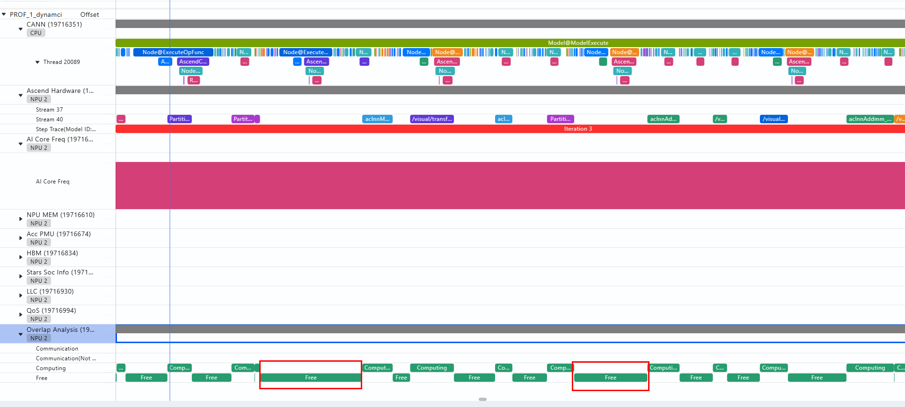
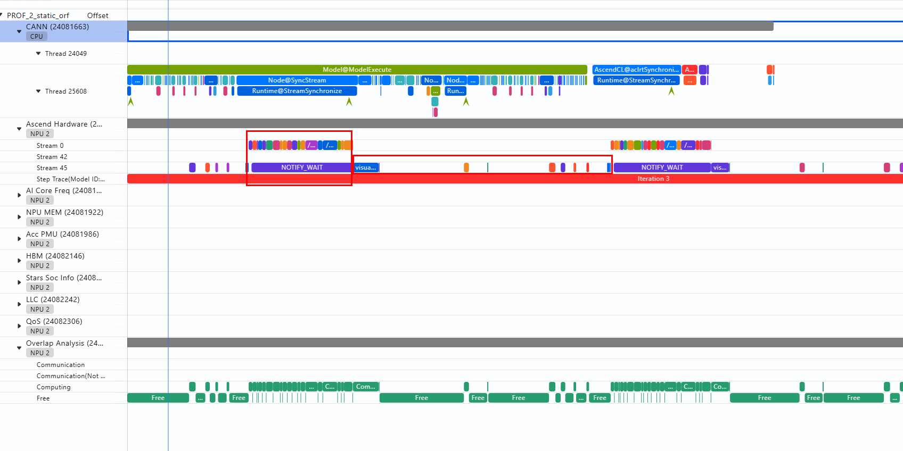
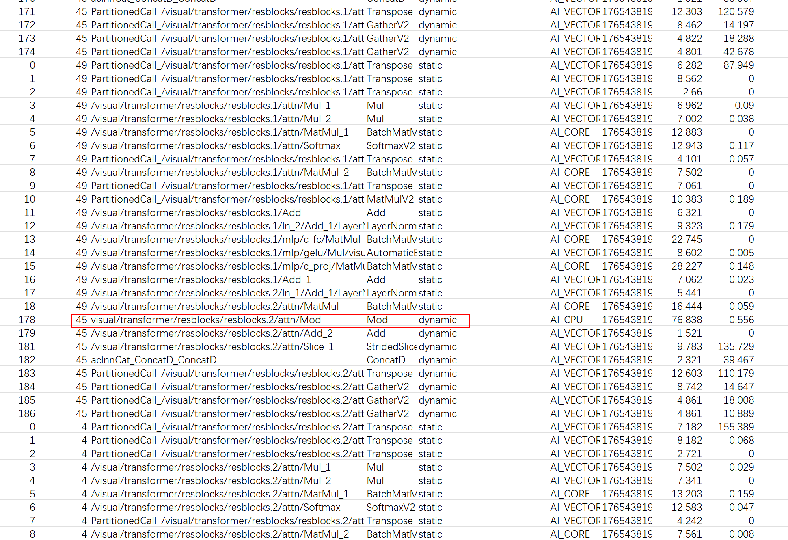
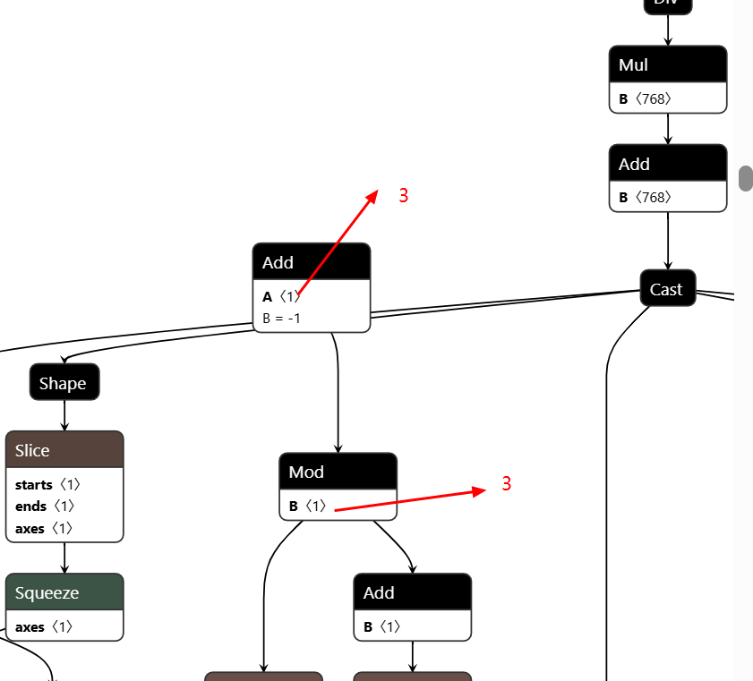
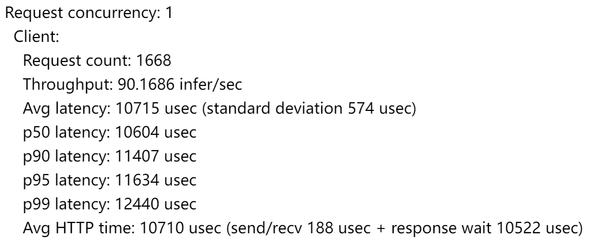
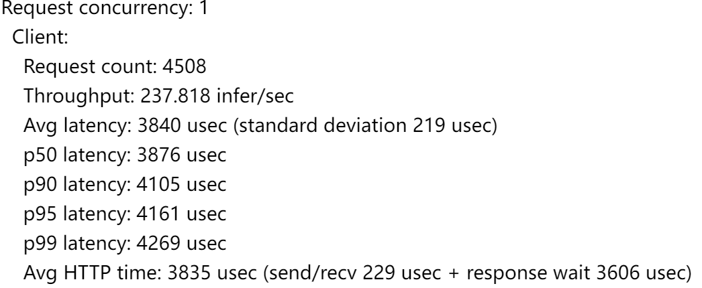
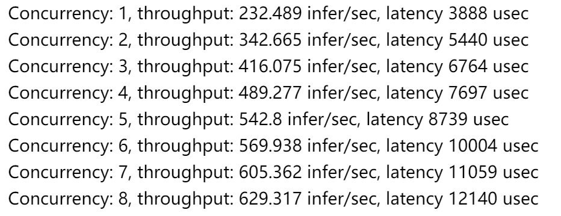
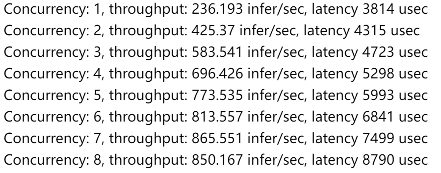
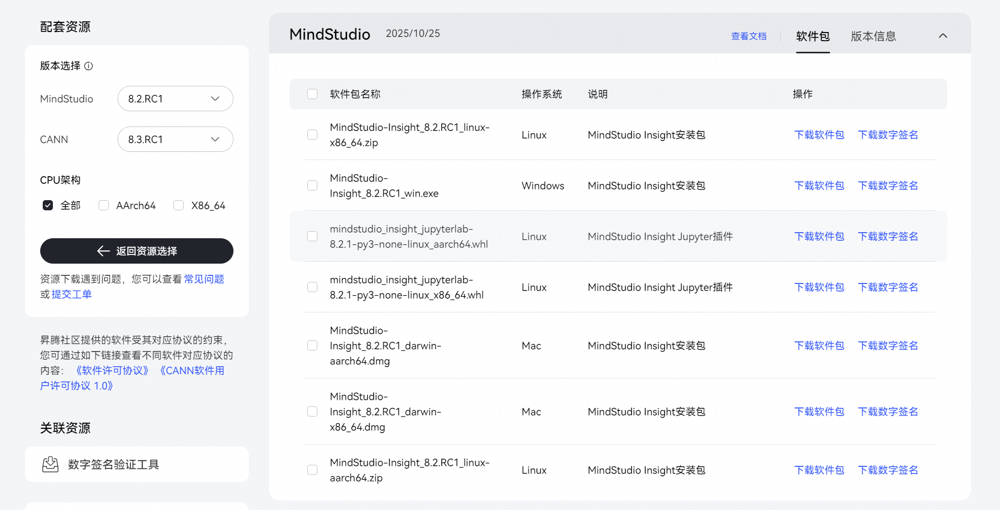
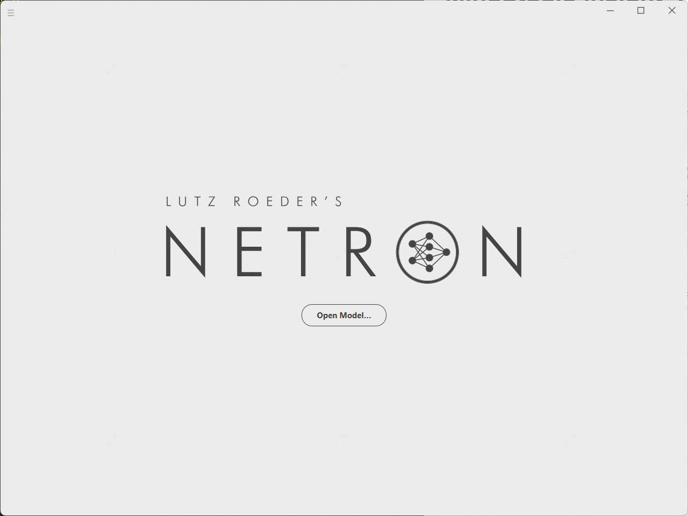

# CN_CLIP模型优化示例
**CLIP**全名**Contrastive Language-Image Pretraining**，在2021年由OpenAI提出，其核心理念为图文对比学习预训练，是一种多模态学习模型，旨在将图像和文本进行关联，它可以快速实现图文特征相似度计算、跨模态检索、零样本图片分类等任务。Chinese-CLIP（**CN_CLIP**）是一次极其朴素的开源，没错就是CLIP的汉化，旨在推动中文社区多模态发展，原始的CLIP模型基于英文图文语料，不能用于中文的图文表征提取场景。Chinese-CLIP以英文CLIP视觉侧参数和中文Roberta参数，作为模型初始化值。

**CN_CLIP模型的优化包括：动态图转静态图、多流并行+锁核、ENSEMBLE，未涉及自动融合和融合PASS。因部署采用容器化，且每个容器对cpu有限制，所以未考虑小batch自动融合的动态图优化方案**

## 模型导出
### 修改模型文件
CLIP模型目录如下：
```
clip
├── bert_tokenizer.py
├── configuration_bert.py
├── __init__.py
├── model_configs
│   ├── RBT3-chinese.json
│   ├── RN50.json
│   ├── RoBERTa-wwm-ext-base-chinese.json
│   ├── RoBERTa-wwm-ext-large-chinese.json
│   ├── ViT-B-16.json
│   ├── ViT-B-32.json
│   ├── ViT-H-14.json
│   ├── ViT-L-14-336.json
│   └── ViT-L-14.json
├── modeling_bert.py
├── model.py
├── utils.py
└── vocab.txt
```
由于最终目的是部署推理，需要"**model.py**"中的forward返回值进行修改，具体如下：
```python
def forward(self, image, text, mask_ratio=0):
    assert image is not None or text is not None, "text and image cannot both be None!"

    if image is None:
        return self.encode_text(text)
    elif text is None:
        return self.encode_image(image)
    image_features = self.encode_image(image, mask_ratio)
    text_features = self.encode_text(text)

    image_features = image_features / image_features.norm(dim=-1, keepdim=True)
    text_features = text_features / text_features.norm(dim=-1, keepdim=True)

    # return image_features, text_features, self.logit_scale.exp()
    return image_features, text_features
```
*注：由于self.logit_scale.exp()参数没有shape，而在triton模型仓的config.pbtxt中需要设置输出shape，会导致模型无法运行。*

### 导出模型
首先创建模型，需要选择model_arch（如ViT-B-16）和模型权重（checkpoint）
```python
# prepare the PyTorch implemented model and restore weights
model = create_model(_MODEL_INFO[args.model_arch]['struct'], checkpoint).float().eval()
```
设置输入占位数据：
```python
# prepare empty image and text as input placeholders for ONNX
resolution = _MODEL_INFO[args.model_arch]['input_resolution']
preprocess = image_transform(resolution)
image = preprocess(Image.new('RGB', (resolution, resolution))).unsqueeze(0)
text = clip.tokenize([""], context_length=args.context_length)
```
*注：resolution需根据图像分辨率进行设置，然后调用clip模型自带方法转换成相应shape的输入，此输入的内容不重要，起到占位作用即可。*

使用torch.onnx.export导出模型：
```python
torch.onnx.export(model,
    (image, text),
    fusion_fp32_onnx_path,
    input_names=['image','text'],
    output_names=['unnorm_image_features',"unnorm_text_features"],
    dynamic_axes={
        'image':{0:"batch_size",2:"height",3:"width"}, 
        'text':{0:"batch_size",1:"seq_len"},
        'unnorm_image_features':{0:"batch_size",1:"unnorm_feats"},
        'unnorm_text_features':{0:"batch_size",1:"unnorm_feats"}
    },
    export_params=True,
    do_constant_folding=False,
    opset_version=14,
    verbose=True
)
```
其中，(image.text)构成模型输入，可以根据需求设置为(image,None)，即只导出image分支；input_names 和 output_names 用于设置模型输入输出名称；**导出静态图时应不设置dynamic_axes**参数。

## 动态图转静态图
首先根据模型导出章节的步骤导出ONNX模型，然后据此模型生成GE图，并采集一次Profiling数据（采集方法见Profiling文档），查看整个推理过程是否全部变为静态，模型中是否有dynamic情况，如果有，就需要具体分析是否可以消除。

动态图执行Profiling如下：

可以看到，在动态图下，有好多空泡，在1bs情况下，明显的hostbound问题。

动态图执行Profiling如下：

可以看到一次推理中，前面一部分变成了图下沉模式，而后面出现了部分图又没有下沉成功，这种情况，我们需要打开op_summary_xxx.csv 文件，查看是啥原因导致了图下沉截断。

可以看到在执行Mod操作时，图从前面的static模式变成了dynamic模式，而且算子本身是一个AI_CPU类算子，初步定位为Mod导致问题，我们可以打开onnx 文件查看Mod算子作用，用Netron打开相应的onnx文件。找到这个Mod。

可以看到Mod之前是一个Add计算，A是一个固定值3 ，3-1=2， 2Mod3 = 2 ，每一层均是一个固定值，那这个Mod过程其实可以把Mod这个节点给删掉，让Add的结果2，直接接入到Mod的下面两个节点。
* 删除节点的代码可以通过Deepseek等AI生成，通过修改后，再次跑图，用profiling采集，所有node均变为static。

两者吞吐对比(1 instance)：
1. 动态图：

2. 静态图：


可以看出，在GE静态图场景下，单Instance 都有2.6倍吞吐差异。

## 模型优化
可参考 [性能调优方法论](性能调优方法论.md#3-模型优化) 章节


## 多流并行+锁核
由于代码框架已集成该功能，直接添加启动命令参数启动即可开启，每个Stream限制12个Cube，10个Vector：
```bash
--backend-config=npu_ge,ge.aicoreNum="12|10"
```
* 具体含义请参考[性能调优方法论](性能调优方法论.md#3-多流并行锁核)
性能优化结果如下：

1. 多流并行+优化后静态

2. 多流并行+优化后静态图+锁核


可以看出，在限制每条流的CV核数后，8流并行情况下整体吞吐又有35%的提升。

## ENSEMBLE
为方便分析，删去CLIP模型的text分支，固定batch = 1，则其image输入shape为 [1,3,224,224]。

### 构建预处理 preprocess Python Model
添加模型文件和相应的config.pbtxt:
```bash
preprocess
|-- 1
|   `-- model.py
|-- config.pbtxt
`-- preprocess-py310.tar.gz
```

config.pbtxt文件内容如下：
```json
name: "preprocess"
backend: "python"
input [
  {
    name: "image_binary"
    data_type: TYPE_STRING
    dims: [1]
  }
]
output [
  {
    name: "preprocessed_image"
    data_type: TYPE_FP32
    dims: [1, 3, 224, 224]
  }
]
instance_group [
  {
    count: 8
  }
]
parameters: {
  key: "EXECUTION_ENV_PATH",
  value: {string_value: "$$TRITON_MODEL_DIRECTORY/preprocess-py310.tar.gz"}
}
```
其中，instance_group 参数用于配置preprocess模型的实例数，实例数越多可以应对更高的并发；参数 EXECUTION_ENV_PATH 用于指定Python Model执行依赖Python虚拟环境的路径，宏“$$TRITON_MODEL_DIRECTORY”表示模型仓路径，对应于模型仓中预先放置的“preprocess-py310.tar.gz”包。

*注：Python Model虚拟环境打包方法见附录conda-pack。*

模型代码为：
```python
import numpy as np
from PIL import Image
import io
import triton_python_backend_utils as pb_utils


class TritonPythonModel:
    def initialize(self, args):
        """初始化模型（加载预处理参数）"""
        # CLIP 预训练模型的默认预处理参数（ViT-B-16 为例）
        self.input_size = (224, 224)  # 图像尺寸
        self.mean = np.array([0.48145466, 0.4578275, 0.40821073], dtype=np.float32)  # RGB 均值
        self.std = np.array([0.26862954, 0.26130258, 0.27577711], dtype=np.float32)   # RGB 标准差

    def execute(self, requests):
        """处理推理请求：PNG 解码 → 预处理 → 输出 CLIP 输入"""
        responses = []
        for request in requests:
            # 获取客户端输入的 PNG 字节流
            png_input = pb_utils.get_input_tensor_by_name(request, "image_binary")
            png_bytes_list = png_input.as_numpy()  # 形状: [batch_size]，元素为 bytes

            # 批量处理每张图像
            clip_inputs = []
            for png_bytes in png_bytes_list:
                # 解码 PNG（处理可能的 Alpha 通道）
                image = Image.open(io.BytesIO(png_bytes)).convert("RGB")  # 转为 RGB，丢弃 Alpha

                # 调整尺寸到 CLIP 要求的大小
                image = image.resize(self.input_size, Image.BILINEAR)

                # 转为 numpy 数组（HWC 格式）
                image_np = np.array(image, dtype=np.float32)

                # 转为 CHW 格式（CLIP 输入为 [C, H, W]）
                image_np = image_np.transpose(2, 0, 1)  # (H, W, 3) → (3, H, W)

                # 归一化（减去均值，除以标准差）
                image_np = (image_np / 255.0 - self.mean[:, None, None]) / self.std[:, None, None]

                clip_inputs.append(image_np)

            # 堆叠为批处理张量
            clip_inputs_np = np.stack(clip_inputs, axis=0)  # 形状: [batch_size, 3, 224, 224]

            # 构造输出张量
            output_tensor = pb_utils.Tensor("preprocessed_image", clip_inputs_np)
            inference_response = pb_utils.InferenceResponse(output_tensors=[output_tensor])
            responses.append(inference_response)

        return responses

    def finalize(self):
        """清理资源（可选）"""
        pass
```
### 配置ENSEMBLE
为使能ENSEMBLE能力需要添加一个ENSEMBLE模型仓，其结构如下
```bash
clip_ensemble/
|-- 1
`-- config.pbtxt
```

config文件内容为：
```json
name: "clip_ensemble"
platform: "ensemble"
max_batch_size: 0

input [
  {
    name: "ensemble_image"
    data_type: TYPE_STRING
    dims: [1]
  }
]

output [
  {
    name: "ensemble_feats"
    data_type: TYPE_FP32
    dims: [1, 512]
  }
]

ensemble_scheduling {
  step [
    # 步骤 1：预处理
    {
      model_name: "preprocess"
      model_version: 1
      input_map { key: "image_binary"; value: "ensemble_image" }
      output_map { key: "preprocessed_image"; value: "interm_image" }
    },
    # 步骤 2：CN-CLIP 推理
    {
      model_name: "cn_clip"
      model_version: 1
      input_map { key: "image"; value: "interm_image" }
      output_map { key: "unnorm_image_features"; value: "ensemble_feats" }
    }
}
```
与预处理类似，我还可以在模型输出接后处理模型，将模型输出转为识别类别字符串，降低服务端传回数据量。

CN_CLIP模型输入原始图片数据为RGB彩色图片，字节数为147KB，转为Numpy数组，字节数增加到588KB，是原来的四倍。分别测试CN_CLIP和使用的ENSEMBLE后的吞吐率：
| Model | thoughput (infer/sec) |
|:------:|:-----:|
| CN_CLIP | 836.831  |
| ENSEMBLE | 847.627  |

可以看到，大约有10infer/sec的性能提升。 这是由于数据量变化不是特别大。在帮客户优化Yolo11模型时，发现在本地测试吞吐还不错，大概能到110qps，然而上到环境之后，发现无法达到理论值，仅有30qps左右，经过问题定位，发现是前处理过程中把图片通原始的jpg图片变成了[1,3,3600,3600]的Tensor，导致传输过程成为bound，原始图片一般只有500kB，而前置经过放大拉伸转为tensor后变成74MB左右。如果能把前置过程搬到服务器，通过Triton自带的Ensemble能力，通过流水线方式覆盖前处理过程，就可以在服务器上消除因前处理导致的网络传输bound。经过改造，我们将yolo11的前、后处理均通过ensemble串接为一个新的服务，这个服务只需要传原始图片，即可直接得到最终Text，改造后上线的吞吐由30qps提升至90qps，提升了200%。


# 附录
## MindStudio Insight 下载

下载链接：[https://www.hiascend.com/developer/download/community/result?module=sto%2Bcann](https://www.hiascend.com/developer/download/community/result?module=sto%2Bcann)

选择合适版本下载即可。详细使用方法见[https://www.hiascend.com/document/detail/zh/mindstudio/81RC1/GUI_baseddevelopmenttool/msascendinsightug/Insight_userguide_0002.html](https://www.hiascend.com/document/detail/zh/mindstudio/81RC1/GUI_baseddevelopmenttool/msascendinsightug/Insight_userguide_0002.html)

## Netron 下载
下载链接：[https://github.com/lutzroeder/netron](https://github.com/lutzroeder/netron)

初始界面如下：


选择相应模型文件打开即可查看。

## onnxsim 安装
安装命令：
```bash
pip install onnxsim
```
onnxsim优化命令：
```bash
onnxsim  {旧模型} {新模型}
```
## conda-pack 安装
conda-pack 要打包的python版本需要与ge backend 自带的版本保持一致，当前ge backend中使用的python版本为3.10版本，建议用户制作运行环境时使用此版本python，若必须更换，请参考triton inference server官方文档制作相应的stub文件。   
下载conda-pack：
```bash
conda install conda-pack
```
打包过程：

我们可以从最基本的conda 虚拟环境开始，仅打包模型运行依赖的最小集，可以最大程度减少包的体积。
```bash
conda create --name clip_env python=3.10
```
下载所有依赖包之前，先：
```bash
export PYTHONNOUSERSITE=True
```
安装完所有包后，打包环境：
```bash
conda pack -n clip_env -o package_name.tar.gz
```
更详细的说明见[conda-pack文档.](https://conda.github.io/conda-pack/)
