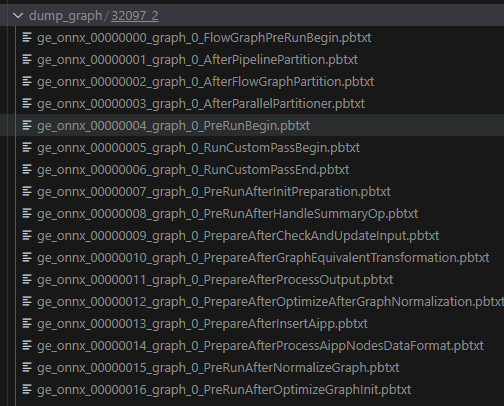

# GE图DUMP
在性能优化过程中，特别是对最终GE图优化中，通常需要将GE编译的图进行DUMP，然后查看不同阶段的GE图，分析是否有优化空间，通过写融合Pass或者算子替换，进行进一步优化。当前框架已集成GE图DUMP功能，通过打开开关，即可进行DUMP。
# 启动方法
当前框架已集成相关能力， 支持两种启动方式。对应 **0** 和 **1** 两种配置，当填写 **0** 时，关闭；**1** 时开启。
## 通过config配置
在config.pbtxt中添加如下参数：
```json
parameters:
{
  key: "dump_graph",
  value: {string_value: "1"}
}
```
## 通过启动参数配置
在启动命令中配置如下参数：
```bash
--backend-config=npu_ge,dump_graph="1"
```
# DUMP文件查看
默认会在工作目录下生成 dump_graph 文件夹，文件夹内会根据 **{主进程号}_{卡号}** 生成不同阶段的GE图。

# DUMP图分析
通过Netron 工具，可以打开相应的pbtxt文件进行查看。