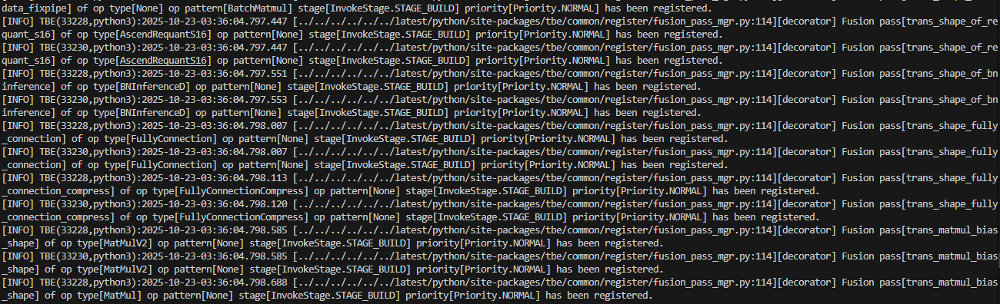

# Plog打印
当模型运行出错时，如果从现有日志中无法判断具体原因，需要打开plog日志查看详细原因。
# Plog介绍
日志主要用于记录系统的运行过程及异常信息，帮助用户快速定位系统运行过程中出现的问题以及开发过程中的程序调试问题。开发者可通过本节描述的环境变量，控制日志的落盘路径以及日志级别等信息。   
日志默认存储路径（$HOME/ascend/log）为了方便调试，可以将plog打印到标准输出中。   
详细说明请参[昇腾官方文档](https://www.hiascend.com/document/detail/zh/canncommercial/850/maintenref/envvar/envref_07_0121.html)。   

# 启动方法
通过环境变量重定向到标准输出中，并调整日志级别：
```
export ASCEND_SLOG_PRINT_TO_STDOUT=1
export ASCEND_GLOBAL_LOG_LEVEL=1
```
在启动脚本后添加重定向 >plog.log   
```
/opt/tritonserver/bin/tritonserver --model-repository {/path/to/models} >plog.log 
``` 
在plog.log里查找ERROR信息

# 成功启动结果
打开成功后，会在输出中包含如下所示plog日志：


*注： Plog 日志较多，建议启动主进程时将输出重定向至文件中。*
