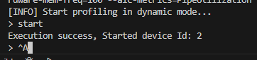
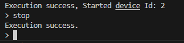
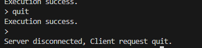

# Profiling采集
在模型调优过程中，通常会通过profiling工具采集算子执行情况，进行进一步分析是否有优化空间。当前框架已集成了profiling功能，只需要通过开启开关即可profiling采集
 
# 采集方法分类
## 动态采集
在程序启动时不执行采集，当需要采集时，通过使用msprof发送指令给主进程启动采集。

**优点：** 可以在出现问题或者推理开始后按需进行profiling采集，防止全周期采集导致数据过大。

## 普通采集
在程序启动后即开始进行采集，当主进程退出后进行数据整理打包。

**优点：** 使用简单，当可控进行推理时可以使用次方式。

# 启动方法
当前框架已集成相关能力， 支持两种启动方式。对应 **“dynamic”** 和 **“true”** 两种配置，当填写 **“dynamic”** 时，走动态采集；**“true”** 时走普通采集。

## 通过config配置
在config.pbtxt中配置如下参数：
```json
parameters:
{
  key: "profiling",
  value: {string_value: "dynamic"}
}
```
## 通过启动参数配置
在启动命令中配置如下参数：
```bash
--backend-config=npu_ge,profiling="dynamic"
```

# 采集过程

## 静态采集
静态采集当主进程启动后就会在当前工作目录下生成 profiling文件夹以及采集的数据。

当进程关闭后，用户可以执行如下命令生成最终结果。
```bash
cd profiling/PROF_*
msprof --export=on --output=./
```
执行后，会在当前的profiling中生成output文件

通过 MindStudio Insight 或者 excel即可进行分析。

## 动态采集
当主进程启动后， msprof处于待采集状态， 通过另起一个shell 执行一下指令即可链接主进程，控制其采集行为：
```bash
msprof --dynamic=on --output=./profiling --model-execution=on --runtime-api=on --aicpu=on --sys-hardware-mem=on --sys-hardware-mem-freq=100 --aic-metrics=PipeUtilization --ai-core=on --pid={主进程ID}
```
动态采集用户可以在需要采集时指定相关参数，比如调整aic-metrices、采集位置等， 其中**pid为triton主进程id**， 默认打开profiling时日志中会打印，也可以通过ps指令查看。  
   
执行成功后，会出现如上提示。当需要执行采集时，输入 **start** 即可。此时将会生成相应的profiling文件。  
  
执行相关的推理任务， 当执行完成后，输入 **stop** 即可停止采集。  
  
输入 **quit** 即可退出。  
   
与静态采集相同，进入相应的Prof结果文件夹执行如下指令：  
```bash
cd profiling/PROF_*
msprof --export=on --output=./
```
执行完成后会生成相应的output文件   
   


##### profiling分析
将profiling文件倒回本地，使用MindStudio Insight工具即可打开对模型执行过程进行分析。具体分析方法请参考昇腾相关文档。
* MindStudio Insight 工具下载方法请参考 [性能调优方法论] 中附录部分。


