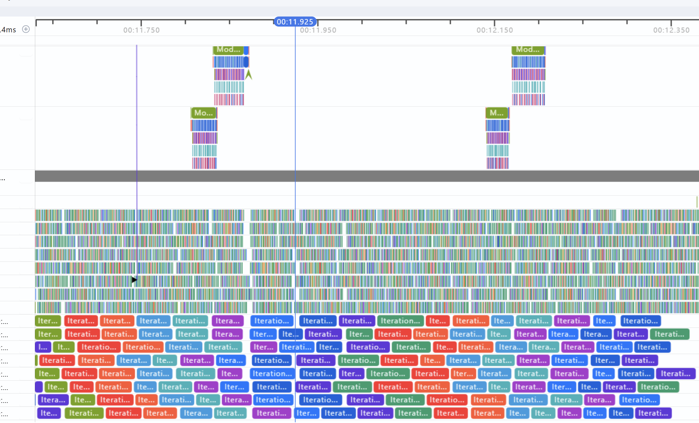
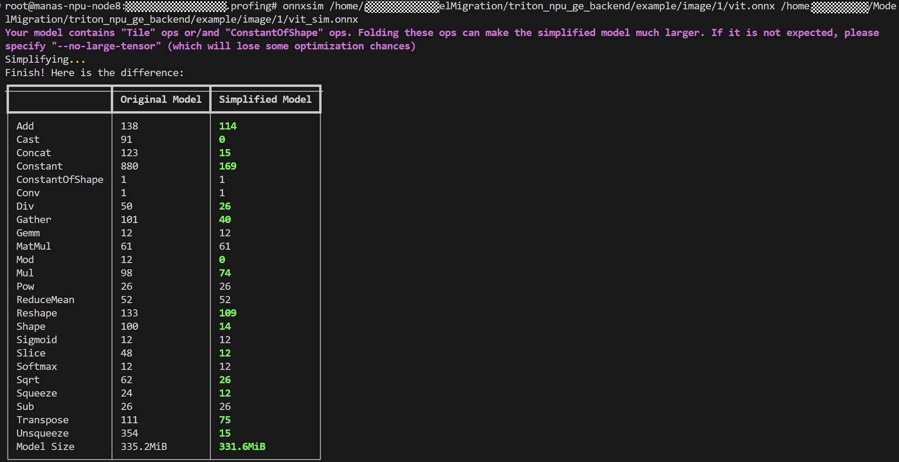
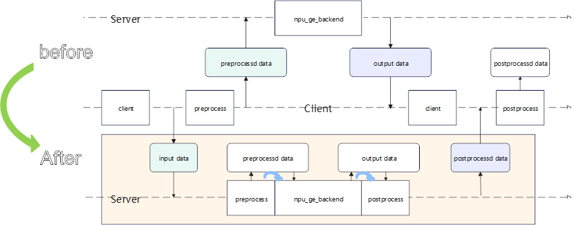

# 性能调优方法论
模型优化有一套通用的流程，本文档首先介绍一下通用的优化手段，然后再以cnclip模型为例，为大家提供模型接入、运行、优化整体过程。

# 优化步骤总结
## 1. 开启小batch自动合并模式
triton server 支持在高吞吐模式下在用户设置的间隙时间内若存在多个小batch请求，将其合并为大batch，从而提高NPU利用率。以cnclip模型的image过程为例，在config.pbtxt中配置动态batch参数：
``` json
dynamic_batching {
  max_queue_delay_microseconds: 10000  # 等待合并的最大延迟（微秒），可调整
  preferred_batch_size: [4, 8]    # 优先合并成这些batch_size（可选）
}
```
* 注：此模式只支持0轴为bs动态轴，其余轴固定的情况！！！   

该参数含义如下：在10ms内，若多个request可以合并为 4,8 大小的batch则将其合并后计算。  
若所有请求均为1bs：则当达到4bs时将会执行，不会到达8bs，所以要根据请求情况进行调整；若经过测试，在8bs时吞吐最好，则建议preferred_batch_size 仅保留 8。  
若请求均为随机：则根据请求顺序进行拼接，达到 4,8 bs的请求会被合并，从而加快计算。   
在理想情况下，比如我们用8个并发，每个请求1bs，则如果8个并发恰好在10ms内请求到server，则会被合并成一个8bs的推理任务，推理完成后再拆分分别响应。这样做的前提是处理8个1bs推理任务要比1个8bs的任务耗时长才有收益。所以在填写之前，用户需要自行测试亲和batch进行填写。  
因8个请求在理想情况下合并为1个推理任务，一张NPU建议stream不大于8，那么在最理想的情况下8个stream可以处理8*8个请求，也就是64个并发任务。我们将config中的count等信息做如下修改：
``` json
instance_group [{ 
  count: 64
}
]

parameters: [
{
  key: "device_ids",
  value: {string_value: "2"}
}
]

parameters: [
{
  key: "device_exec_blocks",
  value: {string_value: "8"}
}
]
```
默认情况下count如果填写64，在卡上会开相应的stream，显然64条stream没必要，可以通过 device_exec_blocks 参数进行限制每张卡上支持的流水数量，使其为 8。
在1张卡的情况下，我们限制server最多支持64个请求并发，在NPU侧因配置了动态合并参数，当吞吐率高的情况下会合并成刚好8个stram可以处理。此时达到最优吞吐。  
测试数据：  
在不开启小batch动态合并时，用1bs，1并发，测试：   
```
Request concurrency: 1
  Client: 
    Request count: 3445
    Throughput: 191.355 infer/sec
    Avg latency: 5224 usec (standard deviation 306 usec)
    p50 latency: 5220 usec
    p90 latency: 5393 usec
    p95 latency: 5677 usec
    p99 latency: 6408 usec
    Avg HTTP time: 5218 usec (send/recv 110 usec + response wait 5108 usec)
  Server: 
    Request count: 0
Inferences/Second vs. Client Average Batch Latency
Concurrency: 1, throughput: 191.355 infer/sec, latency 5224 usec
```
因动态图每一节点tiling计算在CPU侧，在机选完成后才能发送至NPU执行，所以在单流1bs下性能较差。   
在开启小batch合并，且用1bs，64并发，测试：   
```
Request concurrency: 64
  Client: 
    Request count: 23940
    Throughput: 1329.13 infer/sec
    Avg latency: 48084 usec (standard deviation 13285 usec)
    p50 latency: 47319 usec
    p90 latency: 49055 usec
    p95 latency: 49707 usec
    p99 latency: 51560 usec
    Avg HTTP time: 48075 usec (send/recv 319 usec + response wait 47756 usec)
  Server: 
    Request count: 0
Inferences/Second vs. Client Average Batch Latency
Concurrency: 64, throughput: 1329.13 infer/sec, latency 48084 usec
```
可以看到性能提升明显， 通过profiling分析：   
   
可以看出在64条请求并发情况下，NPU使用率有明显提升，空泡减少明显。  
该优化也可叠加锁核方式，提高p99指标。   
<font color="#dd0000"> 注意：   
此方法虽吞吐效果明显，但在整体考虑资源时需要合理规划。此方法是通过CPU换NPU性能，目前仅测试单张卡就使用了64核，若考虑一台服务器有8张卡，如果均使用此种方式，性能肯定无法达到8*单张吞吐。所以需要用户综合考虑使用场景，调整并发度。
</font>

### 1.1 使用分档模式
当请求中可以确定bs <= 最大亲和bs 时，如上示例中 max_batch_size <= max [2, 4, 8] , 我们可以尝试通过分档，将不同bs大小生成静态图，从而支持图下沉方式推理，进一步提高吞吐。  
比如 preferred_batch_size: [2, 4, 8] ， 那在理想情况下， 请求会被合并成 2,4,8 bs 进行推理，但在某些时段，由于请求数量少，无法拼接为2,4,8 时，就会有可能形成1,3,5,6,7 bs 长度的请求。所以在配置分档时，要确保分档能覆盖所有bs。   
开启方式可通过config.pbtxt 或者 命令行参数生效，如上例子，模型有1个输入，shape信息为image:[-1,3,224,224]，则配置示例为：
```
parameters: [
{
  key: "graph.ge.inputShape",
  value: {string_value: "image:-1,3,224,224"}
}
]

parameters: [
{
  key: "graph.ge.dynamicDims",
  value: {string_value: "1;2;3;4;5;6;7;8"}
}
]

parameters: [
{
  key: "graph.ge.dynamicNodeType",
  value: {string_value: "1"}
}
]
```
或者通过在命令行后添加参数进行使能：
```
--backend-config=npu_ge,graph.ge.inputShape="image:-1,3,224,224" \
--backend-config=npu_ge,graph.ge.dynamicDims="1;2;3;4;5;6;7;8"  \
--backend-config=npu_ge,graph.ge.dynamicNodeType="1"
```
若input为多个，可参考 [Ascend Graph构图接口 options参数说明](https://www.hiascend.com/document/detail/zh/canncommercial/82RC1/API/ascendgraphapi/atlasgeapi_07_0150.html#ZH-CN_TOPIC_0000002370141369__section1179795275614) 进行详细配置。   
* 注：dynamicDims 数量过多会导致模型编译过程变长。


### 1.2 尝试锁核
在小batch场景下，小模型每条流使用完整核会有较大的启动开销，也就是通过控制使用较小核数量，可以通过降低启动开销来进一步提高吞吐率。使能方法支持config.pbtxt以及命令行参数：
``` bash
parameters: [
{
  key: "ge.aicoreNum",
  value: {string_value: "12|10"}
}
]
```
或
``` bash
--backend-config=npu_ge,ge.aicoreNum="12|10"
```
其中 12|10 代表 每条流使用12个cube核，10个vector核。不同产品型号昇腾AI处理器包含的最大AICore-CubeCore与AICore-VectorCore的数量可从"${INSTALL_DIR}/\<arch\>-linux/data/platform_config/xxx.ini"文件查看。   
具体值填写多少需根据模型本身整体运行占用CV核情况进行调整，过大、过小均会影响吞吐，可以通过调整后进行性能测试来逐步逼近最优值。   
详细说明可参考 [Ascend Graph构图接口 options参数说明](https://www.hiascend.com/document/detail/zh/canncommercial/82RC1/API/ascendgraphapi/atlasgeapi_07_0150.html#ZH-CN_TOPIC_0000002370141369__section1179795275614) 进行详细配置。   


## 2. 动态图转静态图
当推理场景不存在动态batch场景，则可考虑使用静态图进行推理。(若bs始终为1，可考虑使用小batch合并进行优化，效果要比直接使用该章节吞吐率好)。onnx模型在编译完成后，默认使用动态图模式，此模式下因input中可能存在动态shape，所以无法在编译阶段完全计算出每个节点所需显存资源，需要根据真实的input进行动态计算，计算显存大小过程在CPU侧，所以很可能出现CPU侧导致的HostBound，为了使性能达到最优，如果我们的input可以改为静态shape，则可以使其在编译阶段直接计算出每个节点所需显存资源，执行过程可以下沉至NPU中，此时执行过程中CPU不再参与运算，从而达到NPU的利用率最大化。   
静态图GE支持分档场景以及全静态场景：   
### 2.1 分档场景
若input中非bs轴存在动态轴，且具体shape为固定档位，比如cnclip模型image shape[1,3,-1,1], 后两个轴取值只有 224,224 或 336,336， 则可通过分档方式，将执行图转为静态图。
```
parameters: [
{
  key: "graph.ge.inputShape",
  value: {string_value: "image:1,3,-1,-1"}
}
]

parameters: [
{
  key: "graph.ge.dynamicDims",
  value: {string_value: "224,224;336,336"}
}
]

parameters: [
{
  key: "graph.ge.dynamicNodeType",
  value: {string_value: "1"}
}
]
```
或者通过在命令行后添加参数进行使能：
```
--backend-config=npu_ge,graph.ge.inputShape="image:1,3,-1,-1" \
--backend-config=npu_ge,graph.ge.dynamicDims="224,224;336,336"  \
--backend-config=npu_ge,graph.ge.dynamicNodeType="1"
```
详细说明可参考 [Ascend Graph构图接口 options参数说明](https://www.hiascend.com/document/detail/zh/canncommercial/82RC1/API/ascendgraphapi/atlasgeapi_07_0150.html#ZH-CN_TOPIC_0000002370141369__section1179795275614) 进行详细配置。  

### 2.2 全静态场景 
非动态分档场景指模型输入shape均为标量。
通过config添加配置：
```json
parameters:
{
  key: "static_model"
  value: {string_value: "1"}
}
```
或通过启动参数配置
```bash
--backend-config=npu_ge,static_model="1"
```
即可使能静态图。具体使用哪种请自行选择。  
具体是否生效，需要采集Profiling，查看是否所有节点均为static。采集工具请参考 [Profiling 工具使用](./tools/Profiling.md)

## 3. 模型优化
动态图转静态图Netron 查看是否有无需计算的节点，转静态图后，某些节点可能导致静态图回到动态图，定位手段就是采集Profiling，以CN_CLIP模型为例，当用原始的model直接开启静态图模式后，通过分析Profiling结果，结合Netron，是否整图可以下沉，哪些节点可以删除。如上一节中的删除Mod节点，目的是让全图下沉。

在转静态图后，某些模型可能存在大片节点变成了固定值，但编译器无法自动优化，需要我们去做分析，一部分可以通过人工编辑onnx图，也可以通过辅助工具来实现，在实践过程中，我们发现onnxsim可以将一些固定节点向下合并，可以消除如Mod等输入都是固定的节点，从而优化模型。

CN_CLIP通过onnxsim工具的优化结果如下：


可以看出，CN_CLIP经过优化后，把Mod等固定的计算节点进行了优化，比原始图少了好多节点。

*注：MindStudio和Netron工具安装与使用方法见[附录](./附录.md)。*

## 3. 多流并行+锁核
当用户在 config中用户设置 instance_group.count 的值>1 时，无论动态图模式或者静态图模式，采用多流并行方式执行。 建议 count值不要过大，会影响单个推理稳定性，造成p99变大。推荐不要超过8。
当采用动态图模式时，CPU侧需要动态计算每一个节点输入的shape，无法实现最大吞吐，所以如果在动态图模式下通过调整count无法达到吞吐指标，可以尝试转静态图后观察吞吐情况。  
目前GE图模式实现了锁核能力，也就是可以限制某一个Stream只使用其中一部分Vector核一部分Cube核，这样剩下的资源可以让其他Stream使用；算子在启动core的过程中使用的core越多消耗越大，而对于小模型，特别是小shape场景，用整个核其实存在资源浪费情况，如果能合理切分，让多条流同时使用CV核，反而要比只让一个Stream使用效果要好。

常用锁核参数（C|V）有：“12|10”、“7|10”等，这些参数都是经验值，也可以根据实际模型测试找到最佳锁核值。本框架锁核功能可通过如下命令参数开启：
```bash
--backend-config=npu_ge,ge.aicoreNum="12|10"
```
* 注：芯片型号不同，对应的CV核数也不一样。CV核数不能大于本芯片的CV核数，具体芯片CV核数请参考 [Ascend Graph构图接口 options参数说明](https://www.hiascend.com/document/detail/zh/canncommercial/82RC1/API/ascendgraphapi/atlasgeapi_07_0150.html#ZH-CN_TOPIC_0000002370141369__section1179795275614)。

## 4. 自动融合
自动融合在某些场景下会有性能收益，使用方法也比较简单，通过环境变量即可激活，目前已包含在CANN版本中。正式环境变量使用样例：
1. 功能控制
```bash
export AUTOFUSE_FLAGS="--enable_autofuse=true;--autofuse_disable_pass=reduce,concat,slice;--autofuse_enable_pass=transpose;--autofuse_att_algorithm=xx"
```
2. DFX控制
```bash
export AUTOFUSE_DFX_FLAGS="--att_accuracy_level=1;--att_profiling=true;--autofuse_enable_dump_orign_graph=true"
```
具体如何使用请参考[AutoFuse自动融合](https://www.hiascend.com/document/detail/zh/canncommercial/83RC1/graph/autofuse/autofuse_1_0001.html)

## 5. 尝试使用float16推理
若使用onnx转om进行推理时，默认atc会使用float16进行优化。当前框架为保证精度默认使用图原始精度(origin)进行推理，若使用float16进行推理，可显著提高推理性能，使能float16后，要系统性测试精度是否达标，若精度满足要求则可保留。
使能方法支持config.pbtxt以及命令行参数：
```bash
parameters: [
{
  key: "session.ge.exec.precision_mode_v2",
  value: {string_value: "fp16"}
}
]
```
或
```bash
--backend-config=npu_ge,session.ge.exec.precision_mode_v2="fp16"
```
详细说明可参考 [Ascend Graph构图接口 options参数说明](https://www.hiascend.com/document/detail/zh/canncommercial/82RC1/API/ascendgraphapi/atlasgeapi_07_0150.html#ZH-CN_TOPIC_0000002370141369__section1179795275614) 进行详细配置。  

## 6. ENSEMBLE
在执行模型推理的过程会出现预处理后的数据量大于原始数据量，增加数据耗时，甚至导致传输 Bound，进而影响端到端吞吐率。
Triton Inference Server原生支持python backend和Ensemble能力，这样可以将多个不同模型（后端可以不同）串联起来形成一条推理流水线。通过将模型的前后处理封装成python model可以降低传输数据量，避免传输Bound情况的出现。其改造如下所示：  


详细使用可参考下方优化案例。

## 7. 融合PASS
在所有优化手段都使用后，如果性能仍不达标，就需要具体分析耗时长算子、或者看哪些算子能融合，这个代价就比较高，需要打开具体的模型图，分析哪些算子执行过程可以做融合，通过编写融合算子以及融合Pass，替换GE图中某些节点，从而优化整网性能，此类方法一般在性能要求比较高的模型中进行，或者因当前NPU存在短板，比如对int64支持不佳等场景下，需要手工写新的算子进行全局替换，进行优化。  
*注：相关文档可参考昇腾官方文档：[Ascend Graph开发](https://www.hiascend.com/document/detail/zh/CANNCommunityEdition/81RC1alpha002/devguide/moddevg/graphdevg/atlasag_25_0001.html).*

# 优化案例
性能优化可参考 [CN_CLIP模型优化示例](CN_CLIP模型优化示例.md)


